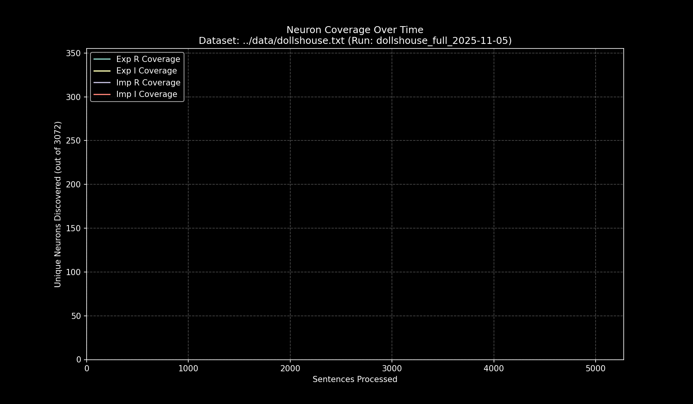

# Data Pipeline Run Report: `dollshouse_full_2025-11-05`

- **Run Start Time:** `2025-11-05T11:57:50.508726`
- **Run End Time:** `2025-11-05T11:59:50.554533`
- **Total Duration:** `0:02:00.045806`

## Processing Summary

- **Source Dataset:** `../data/dollshouse.txt`
- **Sampling Rate:** `100%`
- **Lines Processed:** `5,551 / 5,551`
- **Sentences Processed:** `5,771`
- **Average Speed:** `48.07 sentences/sec`

## Final Neuron Coverage

| Quadrant | Unique Neurons | Coverage |
|:---|---:|---:|
| Exp R | `320` | `10.42%` |
| Exp I | `392` | `12.76%` |
| Imp R | `395` | `12.86%` |
| Imp I | `427` | `13.90%` |

## Output Files

- **Research Log (JSONL):** `output/dollshouse_full_2025-11-05/dollshouse_full_2025-11-05.jsonl`
- **Game Cache (Binary):** `output/dollshouse_full_2025-11-05/dollshouse_full_2025-11-05_exp_r.bin`
- **Game Cache (Binary):** `output/dollshouse_full_2025-11-05/dollshouse_full_2025-11-05_exp_i.bin`
- **Game Cache (Binary):** `output/dollshouse_full_2025-11-05/dollshouse_full_2025-11-05_imp_r.bin`
- **Game Cache (Binary):** `output/dollshouse_full_2025-11-05/dollshouse_full_2025-11-05_imp_i.bin`
- **This Report:** `output/dollshouse_full_2025-11-05/report.md`
- **Coverage Plot:** `output/dollshouse_full_2025-11-05/report_coverage_over_time.png`

## Coverage Visualization

