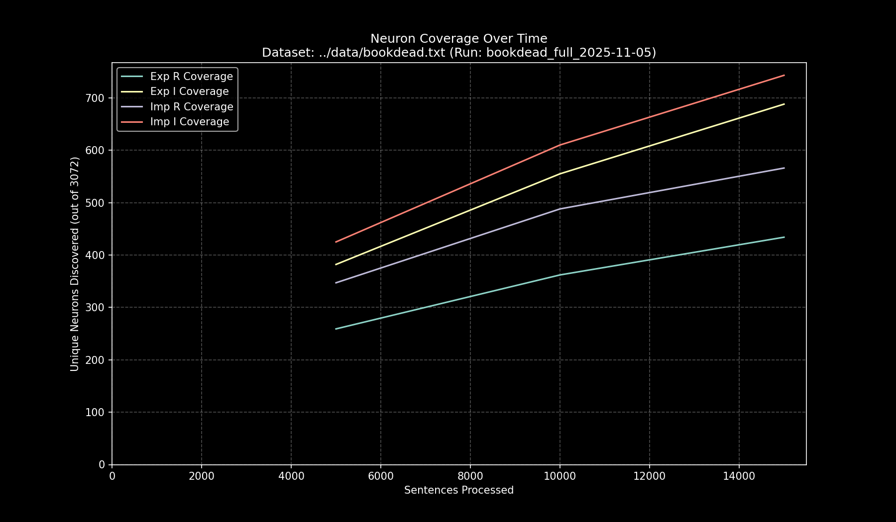

# Data Pipeline Run Report: `bookdead_full_2025-11-05`

- **Run Start Time:** `2025-11-05T17:22:37.995852`
- **Run End Time:** `2025-11-05T17:30:47.610763`
- **Total Duration:** `0:08:09.614911`

## Processing Summary

- **Source Dataset:** `../data/bookdead.txt`
- **Sampling Rate:** `100%`
- **Lines Processed:** `20,688 / 20,688`
- **Sentences Processed:** `19,700`
- **Average Speed:** `40.24 sentences/sec`

## Final Neuron Coverage

| Quadrant | Unique Neurons | Coverage |
|:---|---:|---:|
| Exp R | `504` | `16.41%` |
| Exp I | `803` | `26.14%` |
| Imp R | `627` | `20.41%` |
| Imp I | `852` | `27.73%` |

## Output Files

- **Research Log (JSONL):** `output/bookdead_full_2025-11-05/bookdead_full_2025-11-05.jsonl`
- **Game Cache (Binary):** `output/bookdead_full_2025-11-05/bookdead_full_2025-11-05_exp_r.bin`
- **Game Cache (Binary):** `output/bookdead_full_2025-11-05/bookdead_full_2025-11-05_exp_i.bin`
- **Game Cache (Binary):** `output/bookdead_full_2025-11-05/bookdead_full_2025-11-05_imp_r.bin`
- **Game Cache (Binary):** `output/bookdead_full_2025-11-05/bookdead_full_2025-11-05_imp_i.bin`
- **This Report:** `output/bookdead_full_2025-11-05/report.md`
- **Coverage Plot:** `output/bookdead_full_2025-11-05/report_coverage_over_time.png`

## Coverage Visualization

