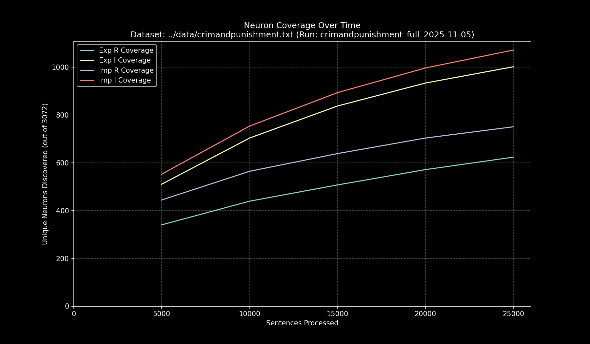

# Data Pipeline Run Report: `crimandpunishment_full_2025-11-05`

- **Run Start Time:** `2025-11-05T15:56:43.169125`
- **Run End Time:** `2025-11-05T16:09:51.895789`
- **Total Duration:** `0:13:08.726664`

## Processing Summary

- **Source Dataset:** `../data/crimandpunishment.txt`
- **Sampling Rate:** `100%`
- **Lines Processed:** `22,444 / 22,444`
- **Sentences Processed:** `27,739`
- **Average Speed:** `35.17 sentences/sec`

## Final Neuron Coverage

| Quadrant | Unique Neurons | Coverage |
|:---|---:|---:|
| Exp R | `648` | `21.09%` |
| Exp I | `1,064` | `34.64%` |
| Imp R | `780` | `25.39%` |
| Imp I | `1,132` | `36.85%` |

## Output Files

- **Research Log (JSONL):** `output/crimandpunishment_full_2025-11-05/crimandpunishment_full_2025-11-05.jsonl`
- **Game Cache (Binary):** `output/crimandpunishment_full_2025-11-05/crimandpunishment_full_2025-11-05_exp_r.bin`
- **Game Cache (Binary):** `output/crimandpunishment_full_2025-11-05/crimandpunishment_full_2025-11-05_exp_i.bin`
- **Game Cache (Binary):** `output/crimandpunishment_full_2025-11-05/crimandpunishment_full_2025-11-05_imp_r.bin`
- **Game Cache (Binary):** `output/crimandpunishment_full_2025-11-05/crimandpunishment_full_2025-11-05_imp_i.bin`
- **This Report:** `output/crimandpunishment_full_2025-11-05/report.md`
- **Coverage Plot:** `output/crimandpunishment_full_2025-11-05/report_coverage_over_time.png`

## Coverage Visualization

