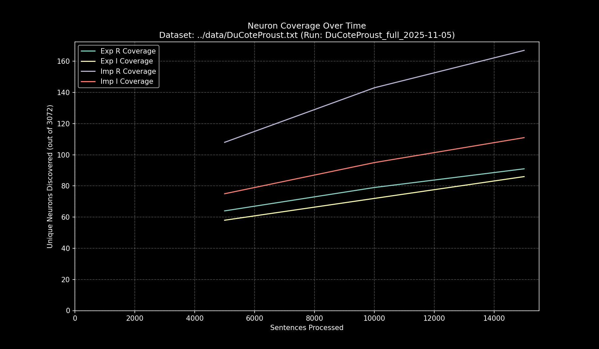

# Data Pipeline Run Report: `DuCoteProust_full_2025-11-05`

- **Run Start Time:** `2025-11-05T13:30:14.261578`
- **Run End Time:** `2025-11-05T13:41:18.945501`
- **Total Duration:** `0:11:04.683923`

## Processing Summary

- **Source Dataset:** `../data/DuCoteProust.txt`
- **Sampling Rate:** `100%`
- **Lines Processed:** `16,541 / 16,541`
- **Sentences Processed:** `18,692`
- **Average Speed:** `28.12 sentences/sec`

## Final Neuron Coverage

| Quadrant | Unique Neurons | Coverage |
|:---|---:|---:|
| Exp R | `138` | `4.49%` |
| Exp I | `181` | `5.89%` |
| Imp R | `228` | `7.42%` |
| Imp I | `210` | `6.84%` |

## Output Files

- **Research Log (JSONL):** `output/DuCoteProust_full_2025-11-05/DuCoteProust_full_2025-11-05.jsonl`
- **Game Cache (Binary):** `output/DuCoteProust_full_2025-11-05/DuCoteProust_full_2025-11-05_exp_r.bin`
- **Game Cache (Binary):** `output/DuCoteProust_full_2025-11-05/DuCoteProust_full_2025-11-05_exp_i.bin`
- **Game Cache (Binary):** `output/DuCoteProust_full_2025-11-05/DuCoteProust_full_2025-11-05_imp_r.bin`
- **Game Cache (Binary):** `output/DuCoteProust_full_2025-11-05/DuCoteProust_full_2025-11-05_imp_i.bin`
- **This Report:** `output/DuCoteProust_full_2025-11-05/report.md`
- **Coverage Plot:** `output/DuCoteProust_full_2025-11-05/report_coverage_over_time.png`

## Coverage Visualization

