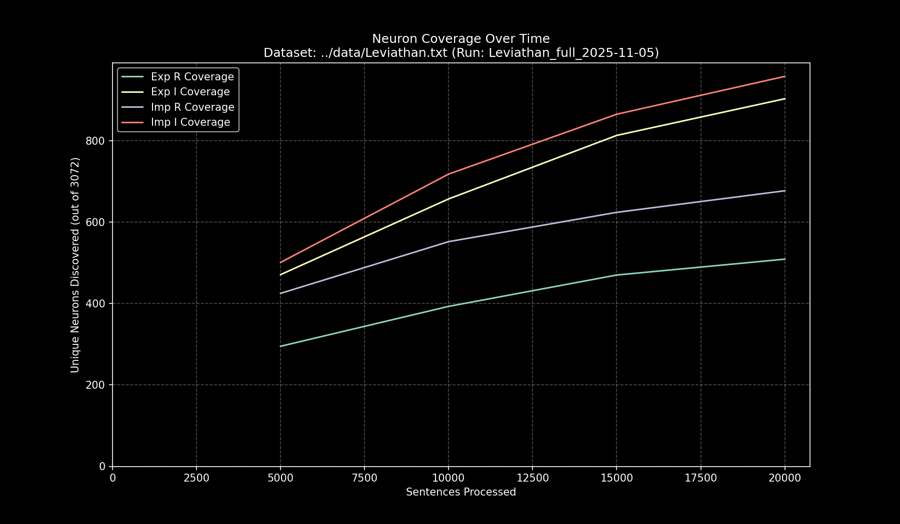

# Data Pipeline Run Report: `Leviathan_full_2025-11-05`

- **Run Start Time:** `2025-11-05T13:48:41.915956`
- **Run End Time:** `2025-11-05T14:00:10.823967`
- **Total Duration:** `0:11:28.908010`

## Processing Summary

- **Source Dataset:** `../data/Leviathan.txt`
- **Sampling Rate:** `100%`
- **Lines Processed:** `22,999 / 22,999`
- **Sentences Processed:** `22,920`
- **Average Speed:** `33.27 sentences/sec`

## Final Neuron Coverage

| Quadrant | Unique Neurons | Coverage |
|:---|---:|---:|
| Exp R | `542` | `17.64%` |
| Exp I | `970` | `31.58%` |
| Imp R | `713` | `23.21%` |
| Imp I | `1,034` | `33.66%` |

## Output Files

- **Research Log (JSONL):** `output/Leviathan_full_2025-11-05/Leviathan_full_2025-11-05.jsonl`
- **Game Cache (Binary):** `output/Leviathan_full_2025-11-05/Leviathan_full_2025-11-05_exp_r.bin`
- **Game Cache (Binary):** `output/Leviathan_full_2025-11-05/Leviathan_full_2025-11-05_exp_i.bin`
- **Game Cache (Binary):** `output/Leviathan_full_2025-11-05/Leviathan_full_2025-11-05_imp_r.bin`
- **Game Cache (Binary):** `output/Leviathan_full_2025-11-05/Leviathan_full_2025-11-05_imp_i.bin`
- **This Report:** `output/Leviathan_full_2025-11-05/report.md`
- **Coverage Plot:** `output/Leviathan_full_2025-11-05/report_coverage_over_time.png`

## Coverage Visualization

