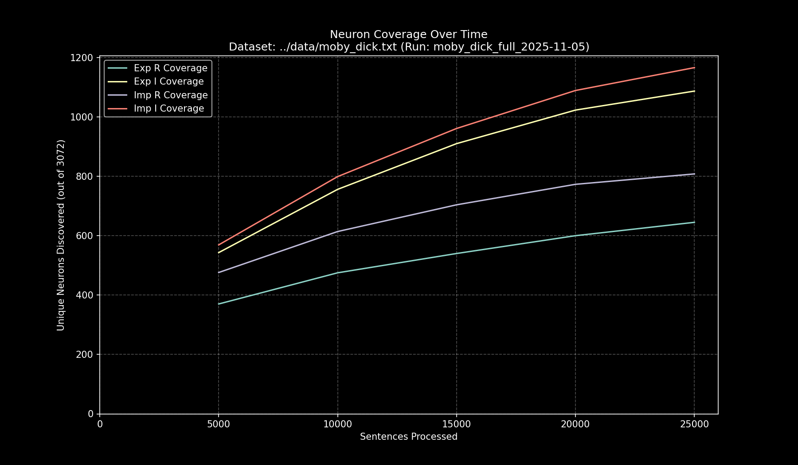

# Data Pipeline Run Report: `moby_dick_full_2025-11-05`

- **Run Start Time:** `2025-11-05T11:27:14.772415`
- **Run End Time:** `2025-11-05T11:39:38.918298`
- **Total Duration:** `0:12:24.145883`

## Processing Summary

- **Source Dataset:** `../data/moby_dick.txt`
- **Sampling Rate:** `100%`
- **Lines Processed:** `21,469 / 21,469`
- **Sentences Processed:** `25,186`
- **Average Speed:** `33.85 sentences/sec`

## Final Neuron Coverage

| Quadrant | Unique Neurons | Coverage |
|:---|---:|---:|
| Exp R | `651` | `21.19%` |
| Exp I | `1,096` | `35.68%` |
| Imp R | `812` | `26.43%` |
| Imp I | `1,174` | `38.22%` |

## Output Files

- **Research Log (JSONL):** `output/moby_dick_full_2025-11-05/moby_dick_full_2025-11-05.jsonl`
- **Game Cache (Binary):** `output/moby_dick_full_2025-11-05/moby_dick_full_2025-11-05_exp_r.bin`
- **Game Cache (Binary):** `output/moby_dick_full_2025-11-05/moby_dick_full_2025-11-05_exp_i.bin`
- **Game Cache (Binary):** `output/moby_dick_full_2025-11-05/moby_dick_full_2025-11-05_imp_r.bin`
- **Game Cache (Binary):** `output/moby_dick_full_2025-11-05/moby_dick_full_2025-11-05_imp_i.bin`
- **This Report:** `output/moby_dick_full_2025-11-05/report.md`
- **Coverage Plot:** `output/moby_dick_full_2025-11-05/report_coverage_over_time.png`

## Coverage Visualization

