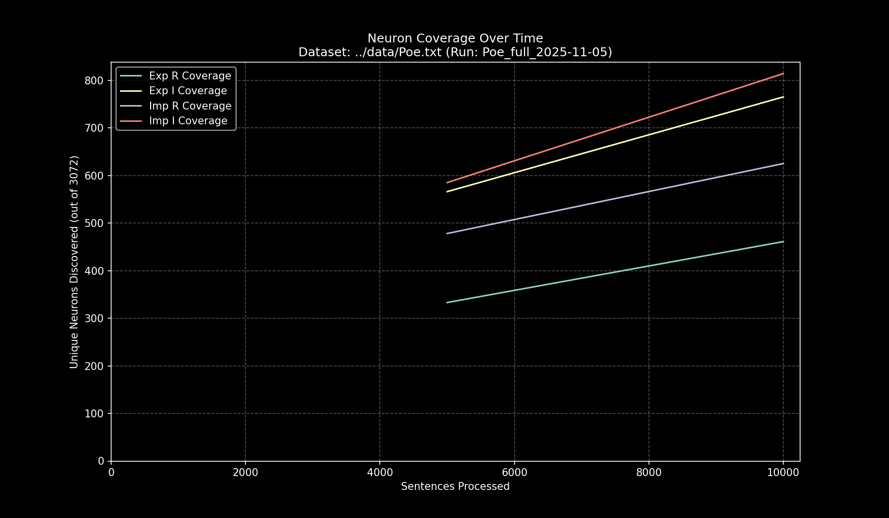

# Data Pipeline Run Report: `Poe_full_2025-11-05`

- **Run Start Time:** `2025-11-05T14:24:48.263521`
- **Run End Time:** `2025-11-05T14:32:16.408005`
- **Total Duration:** `0:07:28.144484`

## Processing Summary

- **Source Dataset:** `../data/Poe.txt`
- **Sampling Rate:** `100%`
- **Lines Processed:** `10,692 / 10,692`
- **Sentences Processed:** `12,478`
- **Average Speed:** `27.84 sentences/sec`

## Final Neuron Coverage

| Quadrant | Unique Neurons | Coverage |
|:---|---:|---:|
| Exp R | `515` | `16.76%` |
| Exp I | `870` | `28.32%` |
| Imp R | `684` | `22.27%` |
| Imp I | `918` | `29.88%` |

## Output Files

- **Research Log (JSONL):** `output/Poe_full_2025-11-05/Poe_full_2025-11-05.jsonl`
- **Game Cache (Binary):** `output/Poe_full_2025-11-05/Poe_full_2025-11-05_exp_r.bin`
- **Game Cache (Binary):** `output/Poe_full_2025-11-05/Poe_full_2025-11-05_exp_i.bin`
- **Game Cache (Binary):** `output/Poe_full_2025-11-05/Poe_full_2025-11-05_imp_r.bin`
- **Game Cache (Binary):** `output/Poe_full_2025-11-05/Poe_full_2025-11-05_imp_i.bin`
- **This Report:** `output/Poe_full_2025-11-05/report.md`
- **Coverage Plot:** `output/Poe_full_2025-11-05/report_coverage_over_time.png`

## Coverage Visualization

