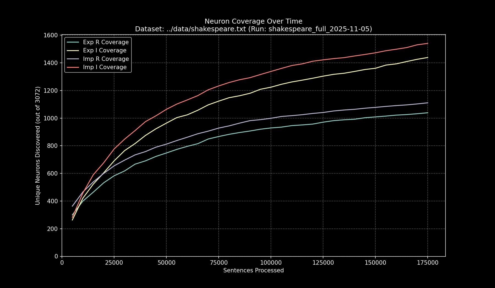

# Data Pipeline Run Report: `shakespeare_full_2025-11-05`

- **Run Start Time:** `2025-11-05T12:08:56.380157`
- **Run End Time:** `2025-11-05T13:27:32.476393`
- **Total Duration:** `1:18:36.096236`

## Processing Summary

- **Source Dataset:** `../data/shakespeare.txt`
- **Sampling Rate:** `100%`
- **Lines Processed:** `196,395 / 196,395`
- **Sentences Processed:** `175,906`
- **Average Speed:** `37.30 sentences/sec`

## Final Neuron Coverage

| Quadrant | Unique Neurons | Coverage |
|:---|---:|---:|
| Exp R | `1,044` | `33.98%` |
| Exp I | `1,457` | `47.43%` |
| Imp R | `1,121` | `36.49%` |
| Imp I | `1,556` | `50.65%` |

## Output Files

- **Research Log (JSONL):** `output/shakespeare_full_2025-11-05/shakespeare_full_2025-11-05.jsonl`
- **Game Cache (Binary):** `output/shakespeare_full_2025-11-05/shakespeare_full_2025-11-05_exp_r.bin`
- **Game Cache (Binary):** `output/shakespeare_full_2025-11-05/shakespeare_full_2025-11-05_exp_i.bin`
- **Game Cache (Binary):** `output/shakespeare_full_2025-11-05/shakespeare_full_2025-11-05_imp_r.bin`
- **Game Cache (Binary):** `output/shakespeare_full_2025-11-05/shakespeare_full_2025-11-05_imp_i.bin`
- **This Report:** `output/shakespeare_full_2025-11-05/report.md`
- **Coverage Plot:** `output/shakespeare_full_2025-11-05/report_coverage_over_time.png`

## Coverage Visualization

