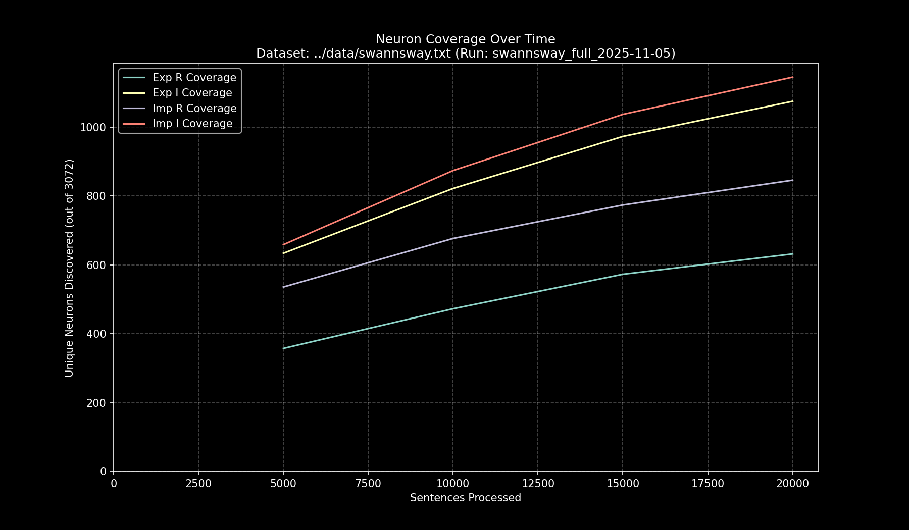

# Data Pipeline Run Report: `swannsway_full_2025-11-05`

- **Run Start Time:** `2025-11-05T16:12:18.511911`
- **Run End Time:** `2025-11-05T16:22:31.941493`
- **Total Duration:** `0:10:13.429582`

## Processing Summary

- **Source Dataset:** `../data/swannsway.txt`
- **Sampling Rate:** `100%`
- **Lines Processed:** `17,420 / 17,420`
- **Sentences Processed:** `20,290`
- **Average Speed:** `33.08 sentences/sec`

## Final Neuron Coverage

| Quadrant | Unique Neurons | Coverage |
|:---|---:|---:|
| Exp R | `642` | `20.90%` |
| Exp I | `1,090` | `35.48%` |
| Imp R | `851` | `27.70%` |
| Imp I | `1,159` | `37.73%` |

## Output Files

- **Research Log (JSONL):** `output/swannsway_full_2025-11-05/swannsway_full_2025-11-05.jsonl`
- **Game Cache (Binary):** `output/swannsway_full_2025-11-05/swannsway_full_2025-11-05_exp_r.bin`
- **Game Cache (Binary):** `output/swannsway_full_2025-11-05/swannsway_full_2025-11-05_exp_i.bin`
- **Game Cache (Binary):** `output/swannsway_full_2025-11-05/swannsway_full_2025-11-05_imp_r.bin`
- **Game Cache (Binary):** `output/swannsway_full_2025-11-05/swannsway_full_2025-11-05_imp_i.bin`
- **This Report:** `output/swannsway_full_2025-11-05/report.md`
- **Coverage Plot:** `output/swannsway_full_2025-11-05/report_coverage_over_time.png`

## Coverage Visualization

