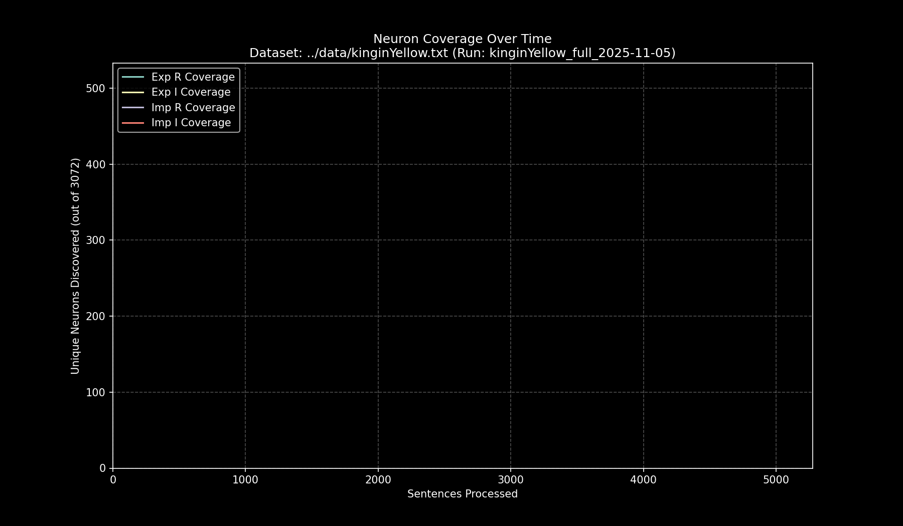

# Data Pipeline Run Report: `kinginYellow_full_2025-11-05`

- **Run Start Time:** `2025-11-05T12:02:02.501842`
- **Run End Time:** `2025-11-05T12:06:33.387316`
- **Total Duration:** `0:04:30.885474`

## Processing Summary

- **Source Dataset:** `../data/kinginYellow.txt`
- **Sampling Rate:** `100%`
- **Lines Processed:** `9,174 / 9,174`
- **Sentences Processed:** `9,394`
- **Average Speed:** `34.68 sentences/sec`

## Final Neuron Coverage

| Quadrant | Unique Neurons | Coverage |
|:---|---:|---:|
| Exp R | `458` | `14.91%` |
| Exp I | `682` | `22.20%` |
| Imp R | `557` | `18.13%` |
| Imp I | `736` | `23.96%` |

## Output Files

- **Research Log (JSONL):** `output/kinginYellow_full_2025-11-05/kinginYellow_full_2025-11-05.jsonl`
- **Game Cache (Binary):** `output/kinginYellow_full_2025-11-05/kinginYellow_full_2025-11-05_exp_r.bin`
- **Game Cache (Binary):** `output/kinginYellow_full_2025-11-05/kinginYellow_full_2025-11-05_exp_i.bin`
- **Game Cache (Binary):** `output/kinginYellow_full_2025-11-05/kinginYellow_full_2025-11-05_imp_r.bin`
- **Game Cache (Binary):** `output/kinginYellow_full_2025-11-05/kinginYellow_full_2025-11-05_imp_i.bin`
- **This Report:** `output/kinginYellow_full_2025-11-05/report.md`
- **Coverage Plot:** `output/kinginYellow_full_2025-11-05/report_coverage_over_time.png`

## Coverage Visualization

