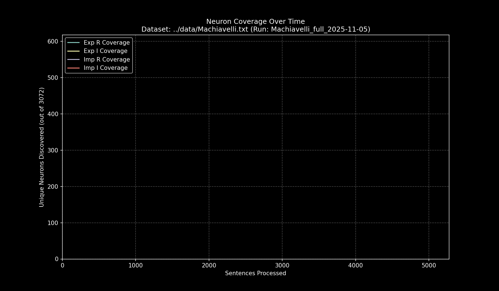

# Data Pipeline Run Report: `Machiavelli_full_2025-11-05`

- **Run Start Time:** `2025-11-05T14:36:41.647840`
- **Run End Time:** `2025-11-05T14:39:28.790900`
- **Total Duration:** `0:02:47.143060`

## Processing Summary

- **Source Dataset:** `../data/Machiavelli.txt`
- **Sampling Rate:** `100%`
- **Lines Processed:** `5,175 / 5,175`
- **Sentences Processed:** `5,567`
- **Average Speed:** `33.31 sentences/sec`

## Final Neuron Coverage

| Quadrant | Unique Neurons | Coverage |
|:---|---:|---:|
| Exp R | `372` | `12.11%` |
| Exp I | `614` | `19.99%` |
| Imp R | `510` | `16.60%` |
| Imp I | `652` | `21.22%` |

## Output Files

- **Research Log (JSONL):** `output/Machiavelli_full_2025-11-05/Machiavelli_full_2025-11-05.jsonl`
- **Game Cache (Binary):** `output/Machiavelli_full_2025-11-05/Machiavelli_full_2025-11-05_exp_r.bin`
- **Game Cache (Binary):** `output/Machiavelli_full_2025-11-05/Machiavelli_full_2025-11-05_exp_i.bin`
- **Game Cache (Binary):** `output/Machiavelli_full_2025-11-05/Machiavelli_full_2025-11-05_imp_r.bin`
- **Game Cache (Binary):** `output/Machiavelli_full_2025-11-05/Machiavelli_full_2025-11-05_imp_i.bin`
- **This Report:** `output/Machiavelli_full_2025-11-05/report.md`
- **Coverage Plot:** `output/Machiavelli_full_2025-11-05/report_coverage_over_time.png`

## Coverage Visualization

