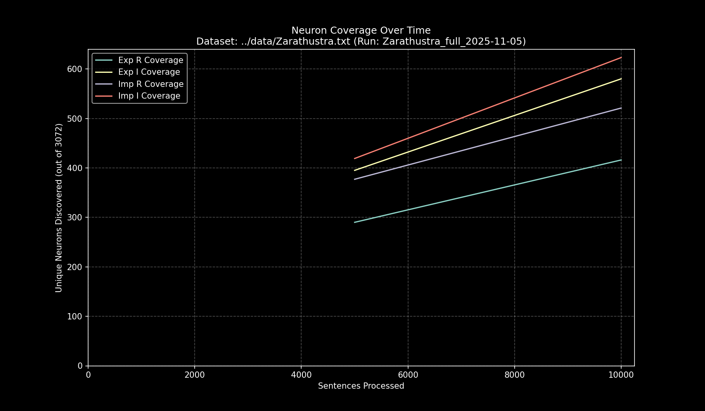

# Data Pipeline Run Report: `Zarathustra_full_2025-11-05`

- **Run Start Time:** `2025-11-05T15:25:46.731288`
- **Run End Time:** `2025-11-05T15:32:36.759257`
- **Total Duration:** `0:06:50.027969`

## Processing Summary

- **Source Dataset:** `../data/Zarathustra.txt`
- **Sampling Rate:** `100%`
- **Lines Processed:** `16,000 / 16,000`
- **Sentences Processed:** `14,738`
- **Average Speed:** `35.94 sentences/sec`

## Final Neuron Coverage

| Quadrant | Unique Neurons | Coverage |
|:---|---:|---:|
| Exp R | `497` | `16.18%` |
| Exp I | `785` | `25.55%` |
| Imp R | `632` | `20.57%` |
| Imp I | `838` | `27.28%` |

## Output Files

- **Research Log (JSONL):** `output/Zarathustra_full_2025-11-05/Zarathustra_full_2025-11-05.jsonl`
- **Game Cache (Binary):** `output/Zarathustra_full_2025-11-05/Zarathustra_full_2025-11-05_exp_r.bin`
- **Game Cache (Binary):** `output/Zarathustra_full_2025-11-05/Zarathustra_full_2025-11-05_exp_i.bin`
- **Game Cache (Binary):** `output/Zarathustra_full_2025-11-05/Zarathustra_full_2025-11-05_imp_r.bin`
- **Game Cache (Binary):** `output/Zarathustra_full_2025-11-05/Zarathustra_full_2025-11-05_imp_i.bin`
- **This Report:** `output/Zarathustra_full_2025-11-05/report.md`
- **Coverage Plot:** `output/Zarathustra_full_2025-11-05/report_coverage_over_time.png`

## Coverage Visualization

