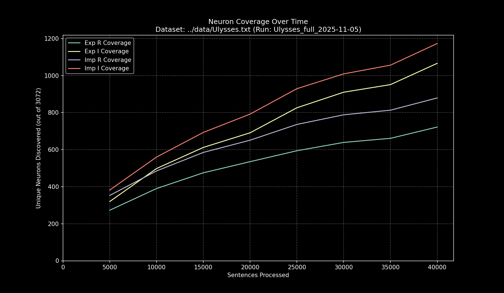

# Data Pipeline Run Report: `Ulysses_full_2025-11-05`

- **Run Start Time:** `2025-11-05T15:03:14.913919`
- **Run End Time:** `2025-11-05T15:21:18.090160`
- **Total Duration:** `0:18:03.176241`

## Processing Summary

- **Source Dataset:** `../data/Ulysses.txt`
- **Sampling Rate:** `100%`
- **Lines Processed:** `33,214 / 33,214`
- **Sentences Processed:** `42,212`
- **Average Speed:** `38.97 sentences/sec`

## Final Neuron Coverage

| Quadrant | Unique Neurons | Coverage |
|:---|---:|---:|
| Exp R | `742` | `24.15%` |
| Exp I | `1,134` | `36.91%` |
| Imp R | `909` | `29.59%` |
| Imp I | `1,241` | `40.40%` |

## Output Files

- **Research Log (JSONL):** `output/Ulysses_full_2025-11-05/Ulysses_full_2025-11-05.jsonl`
- **Game Cache (Binary):** `output/Ulysses_full_2025-11-05/Ulysses_full_2025-11-05_exp_r.bin`
- **Game Cache (Binary):** `output/Ulysses_full_2025-11-05/Ulysses_full_2025-11-05_exp_i.bin`
- **Game Cache (Binary):** `output/Ulysses_full_2025-11-05/Ulysses_full_2025-11-05_imp_r.bin`
- **Game Cache (Binary):** `output/Ulysses_full_2025-11-05/Ulysses_full_2025-11-05_imp_i.bin`
- **This Report:** `output/Ulysses_full_2025-11-05/report.md`
- **Coverage Plot:** `output/Ulysses_full_2025-11-05/report_coverage_over_time.png`

## Coverage Visualization

