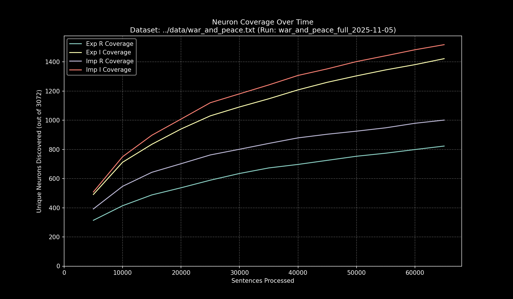

# Data Pipeline Run Report: `war_and_peace_full_2025-11-05`

- **Run Start Time:** `2025-11-05T16:24:24.547329`
- **Run End Time:** `2025-11-05T16:57:44.639654`
- **Total Duration:** `0:33:20.092325`

## Processing Summary

- **Source Dataset:** `../data/war_and_peace.txt`
- **Sampling Rate:** `100%`
- **Lines Processed:** `65,197 / 65,197`
- **Sentences Processed:** `68,773`
- **Average Speed:** `34.38 sentences/sec`

## Final Neuron Coverage

| Quadrant | Unique Neurons | Coverage |
|:---|---:|---:|
| Exp R | `850` | `27.67%` |
| Exp I | `1,472` | `47.92%` |
| Imp R | `1,025` | `33.37%` |
| Imp I | `1,564` | `50.91%` |

## Output Files

- **Research Log (JSONL):** `output/war_and_peace_full_2025-11-05/war_and_peace_full_2025-11-05.jsonl`
- **Game Cache (Binary):** `output/war_and_peace_full_2025-11-05/war_and_peace_full_2025-11-05_exp_r.bin`
- **Game Cache (Binary):** `output/war_and_peace_full_2025-11-05/war_and_peace_full_2025-11-05_exp_i.bin`
- **Game Cache (Binary):** `output/war_and_peace_full_2025-11-05/war_and_peace_full_2025-11-05_imp_r.bin`
- **Game Cache (Binary):** `output/war_and_peace_full_2025-11-05/war_and_peace_full_2025-11-05_imp_i.bin`
- **This Report:** `output/war_and_peace_full_2025-11-05/report.md`
- **Coverage Plot:** `output/war_and_peace_full_2025-11-05/report_coverage_over_time.png`

## Coverage Visualization

