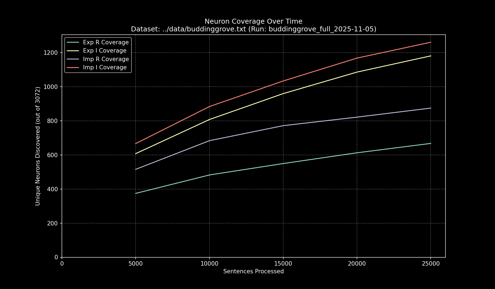

# Data Pipeline Run Report: `buddinggrove_full_2025-11-05`

- **Run Start Time:** `2025-11-05T15:34:42.985335`
- **Run End Time:** `2025-11-05T15:47:14.710022`
- **Total Duration:** `0:12:31.724687`

## Processing Summary

- **Source Dataset:** `../data/buddinggrove.txt`
- **Sampling Rate:** `100%`
- **Lines Processed:** `20,195 / 20,195`
- **Sentences Processed:** `25,028`
- **Average Speed:** `33.29 sentences/sec`

## Final Neuron Coverage

| Quadrant | Unique Neurons | Coverage |
|:---|---:|---:|
| Exp R | `670` | `21.81%` |
| Exp I | `1,180` | `38.41%` |
| Imp R | `875` | `28.48%` |
| Imp I | `1,261` | `41.05%` |

## Output Files

- **Research Log (JSONL):** `output/buddinggrove_full_2025-11-05/buddinggrove_full_2025-11-05.jsonl`
- **Game Cache (Binary):** `output/buddinggrove_full_2025-11-05/buddinggrove_full_2025-11-05_exp_r.bin`
- **Game Cache (Binary):** `output/buddinggrove_full_2025-11-05/buddinggrove_full_2025-11-05_exp_i.bin`
- **Game Cache (Binary):** `output/buddinggrove_full_2025-11-05/buddinggrove_full_2025-11-05_imp_r.bin`
- **Game Cache (Binary):** `output/buddinggrove_full_2025-11-05/buddinggrove_full_2025-11-05_imp_i.bin`
- **This Report:** `output/buddinggrove_full_2025-11-05/report.md`
- **Coverage Plot:** `output/buddinggrove_full_2025-11-05/report_coverage_over_time.png`

## Coverage Visualization

